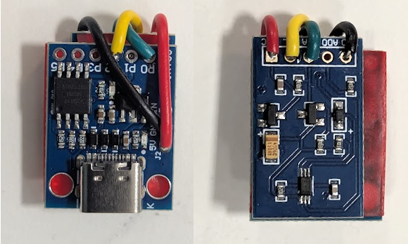

# autoBright
Mobile devices actively control their display brightness by adjusting to ambient light levels.  
For a desktop setting there are (expensive) monitors that have integrated ambient light sensors.  
Even cheap monitors can be controlled via [DDC](https://en.wikipedia.org/wiki/Display_Data_Channel) from any operating system.  
This project combines a microscontroller based [USB HID ambient light sensor](https://github.com/MatejKocourek/spark-als) with python based DDC control on Windows.  

## Overview

To adjuist the monitor brightness main.py uses:
- Windows Sensor API (LightSensor) for lux input
- Windows DXVA2 DDC/CI APIs for monitor brightness output
- a system tray icon with manual offset controls

Further development/integration:
- add the USB HID light sensor function to [TwinkleTray](https://github.com/xanderfrangos/twinkle-tray) or similar software.

## Dependencies

Dependencies for main.py:
- python 3.12
- winsdk
- pystray
- Pillow

Install required packages:

```
pip install pystray pillow winsdk
```

## Autostart on Windows  
Win+R, ```shell:startup```, create shortcut with ```python3.12.exe "path\to\autoBright\main.py"```  

## Hardware
Reading ambient brightness is done with an ATtiny85 and a BH1750 brightness sensor. See [MatejKocourek/spark-als](https://github.com/MatejKocourek/spark-als).  
  
  
  
The folder ```housing``` includes a 3D printable enclosure.
